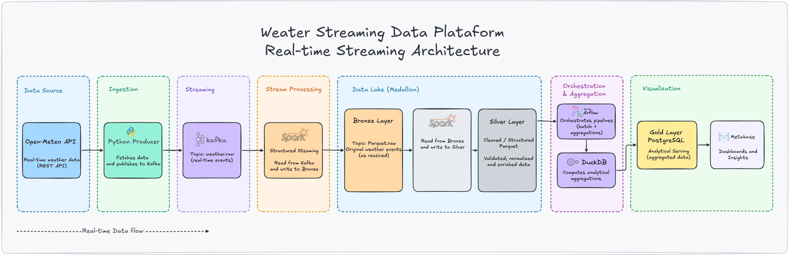
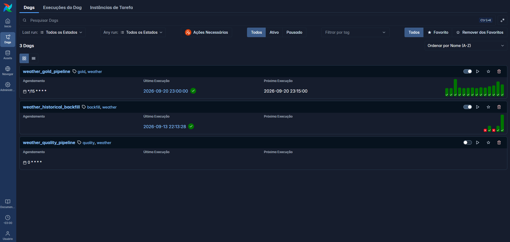
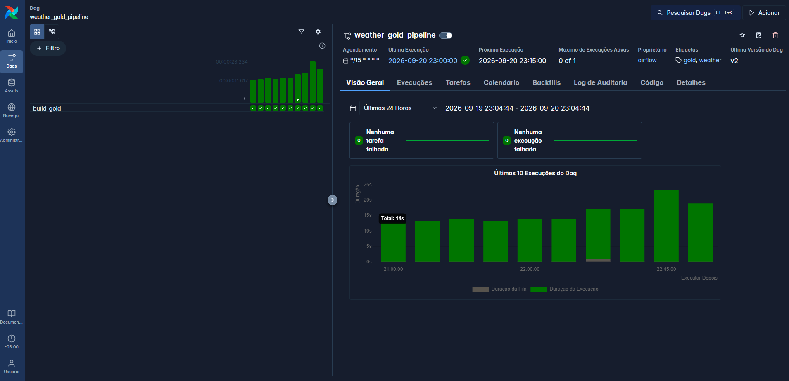
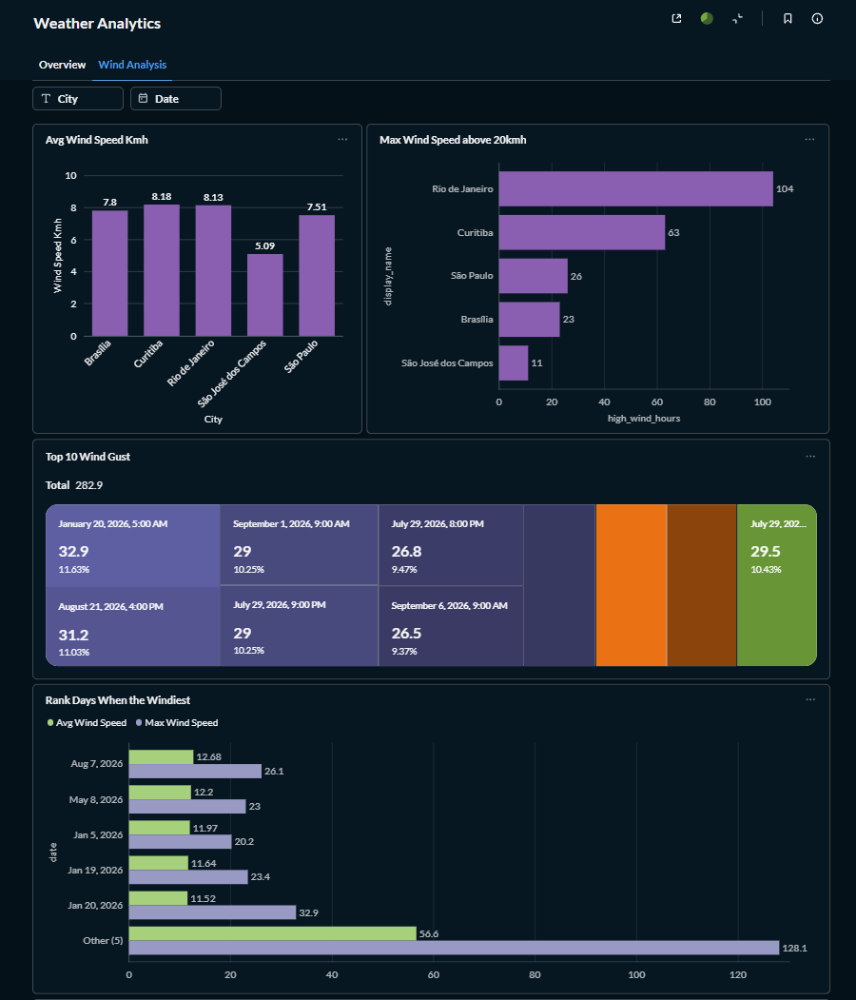
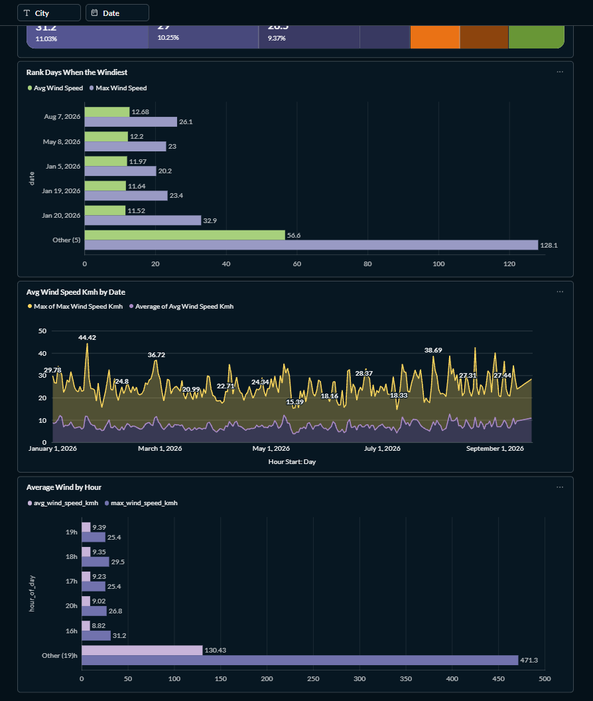
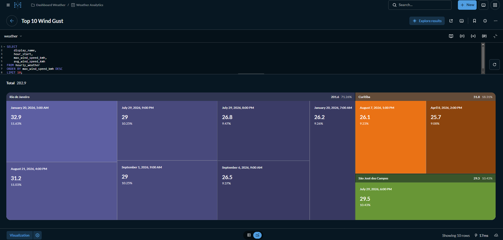

# Weather Streaming Data Platform

End-to-end Data Engineering project that combines real-time weather ingestion, event streaming, distributed processing, historical backfills, orchestration, analytical storage, and visualization using an entirely containerized open-source stack.

The project consumes weather data from the **Open-Meteo API**, publishes events to **Apache Kafka**, processes them continuously with **Apache Spark Structured Streaming**, organizes data into Bronze and Silver layers using **Parquet**, orchestrates analytical workloads and historical backfills with **Apache Airflow**, and serves aggregated data through **PostgreSQL** and **Metabase**.

---

## Architecture



The platform also supports a separate historical ingestion path:

```text
                    HISTORICAL BACKFILL

Open-Meteo Archive API
          │
          ▼
Python Batch Process
          │
          ▼
Historical Normalization
          │
          ▼
Silver Parquet
          │
          ▼
Airflow Gold Pipeline
          │
          ▼
PostgreSQL
```

This separation keeps **real-time ingestion** and **historical batch processing** independent while allowing both pipelines to converge into the same analytical Silver and Gold layers.

---

## Project Goals

This project was created to practice and demonstrate modern Data Engineering concepts in a local, reproducible environment.

The main engineering goals are:

* Event-driven data ingestion
* Streaming data processing
* Medallion-inspired architecture
* Distributed processing with Spark
* Kafka-based event transport
* Incremental analytical processing
* Idempotent data loads
* Historical backfills
* Workflow orchestration
* Data quality validation
* Containerized infrastructure
* Analytical serving layer
* End-to-end pipeline observability

---

## Tech Stack

| Technology                     | Responsibility                                 |
| ------------------------------ | ---------------------------------------------- |
| **Python**                     | API integration, producer and batch processing |
| **Open-Meteo API**             | Current and historical weather data source     |
| **Apache Kafka**               | Event streaming platform                       |
| **Apache Spark**               | Distributed streaming transformations          |
| **Spark Structured Streaming** | Continuous Bronze and Silver processing        |
| **Apache Airflow**             | Workflow orchestration and scheduling          |
| **DuckDB**                     | Analytical processing over Parquet             |
| **Parquet**                    | Bronze and Silver storage format               |
| **PostgreSQL**                 | Gold analytical serving layer                  |
| **Metabase**                   | Data visualization                             |
| **Docker Compose**             | Local infrastructure orchestration             |
| **PyArrow**                    | Historical Parquet generation                  |
| **Pytest**                     | Unit testing                                   |

---

## Real-Time Data Flow

### 1. Weather API

The pipeline retrieves current weather observations from Open-Meteo for configured cities.

Cities are defined through:

```text
config/cities.yaml
```

This keeps location configuration separate from application logic.

---

### 2. Python Producer

The producer periodically requests weather observations from the API.

Each observation is normalized into an event containing information such as:

```text
event_id
city
display_name
latitude
longitude
observed_at
collected_at
temperature_c
relative_humidity_pct
apparent_temperature_c
precipitation_mm
rain_mm
weather_code
cloud_cover_pct
surface_pressure_hpa
wind_speed_kmh
wind_direction_deg
```

A deterministic `event_id` is generated from the city and observation timestamp.

The producer sends these events to Kafka.

---

### 3. Apache Kafka

Kafka acts as the event transport layer between ingestion and processing.

Main topic:

```text
weather.raw
```

The producer and Spark consumers are decoupled, allowing both components to operate independently.

---

### 4. Bronze Layer

Spark Structured Streaming consumes events from Kafka and persists the raw event stream as Parquet.

```text
Kafka
   ↓
Spark Structured Streaming
   ↓
data/bronze/weather/
```

The Bronze layer preserves ingestion metadata such as:

```text
Kafka topic
Kafka partition
Kafka offset
Kafka timestamp
ingestion timestamp
raw payload
```

Spark checkpoints are used to maintain streaming progress.

---

### 5. Silver Layer

A second Spark Structured Streaming process reads Bronze data and applies transformations such as:

* JSON parsing
* Schema enforcement
* Timestamp normalization
* Invalid record filtering
* Event deduplication
* Event-time watermarking
* Date partitioning

The resulting dataset is stored as:

```text
data/silver/weather/
```

Partitioned by observation date:

```text
observation_date=YYYY-MM-DD
```

This layer becomes the canonical analytical dataset consumed by downstream processing.

---

## Gold Layer

The Gold pipeline is orchestrated by Apache Airflow.

The workflow reads Silver Parquet files using DuckDB and generates hourly weather aggregations.

Example metrics include:

```text
Average temperature
Minimum temperature
Maximum temperature
Average humidity
Total precipitation
Average wind speed
Maximum wind speed
Records processed
```

The aggregation grain is:

```text
city + hour_start
```

Results are loaded into PostgreSQL.

---

## Idempotent Gold Loads

The PostgreSQL Gold table uses:

```text
(city, hour_start)
```

as its logical key.

Loads use PostgreSQL:

```sql
INSERT ... ON CONFLICT ... DO UPDATE
```

This allows the Gold pipeline to safely recalculate an hour as additional observations arrive without creating duplicate analytical records.

Records are also processed in deterministic key order to reduce database lock contention.

---

## Pipeline Scheduling

The platform uses different processing frequencies according to workload responsibility.

```text
Open-Meteo API
      │
      │ ~60 seconds
      ▼
Python Producer
      │
      ▼
Kafka
      │
      ▼
Spark Streaming
      │
      ▼
Bronze / Silver
      │
      │ scheduled aggregation
      ▼
Airflow
      │
      ▼
Gold
```

The Gold aggregation pipeline runs periodically through Airflow.

This results in a hybrid architecture:

**near-real-time ingestion + streaming transformations + scheduled analytical aggregation.**

---

## Historical Backfill

Historical data is intentionally processed separately from the Kafka producer.

A dedicated batch process consumes the Open-Meteo historical API:

```text
Open-Meteo Archive API
          ↓
historical_backfill.py
          ↓
Normalization
          ↓
Silver Parquet
```

The backfill can be executed for an arbitrary date interval.

Example:

```bash
python -m src.batch.historical_backfill \
  --start-date 2026-01-01 \
  --end-date 2026-01-31
```

Historical files follow the same Silver data model used by the streaming pipeline.

Example:

```text
data/silver/weather/
├── observation_date=2026-01-01/
│   ├── backfill-sao_jose_dos_campos.parquet
│   ├── backfill-sao_paulo.parquet
│   └── ...
├── observation_date=2026-01-02/
│   └── ...
└── ...
```

Deterministic filenames allow the same city/date backfill to overwrite its previous historical file instead of continuously creating new files.

---

## Airflow Orchestration

Apache Airflow is responsible for scheduled analytical workloads and manual historical processing.





The project includes workflows for:

### Gold Pipeline

```text
Silver
   ↓
DuckDB
   ↓
Hourly Aggregation
   ↓
PostgreSQL
```

### Historical Backfill

```text
Historical API
      ↓
Python Batch
      ↓
Silver
```

The historical DAG can be triggered manually with a configurable date range.

This keeps backfills outside the continuous streaming ingestion path.

---

## Analytics with Metabase

PostgreSQL acts as the serving layer for analytical workloads.

Metabase connects directly to the Gold database and can be used to create dashboards for metrics such as:







* Temperature evolution
* Temperature comparison between cities
* Humidity
* Precipitation
* Wind speed
* Historical weather trends

Metabase is available locally at:

```text
http://localhost:3000
```

---

## Project Structure

```text
weather-streaming-data/
│
├── airflow/
│   └── dags/
│       ├── weather_gold_pipeline.py
│       └── weather_historical_backfill.py
│
├── config/
│   └── cities.yaml
│
├── data/
│   ├── bronze/
│   ├── silver/
│   └── checkpoints/
│
├── docker/
│   ├── airflow/
│   │   └── Dockerfile
│   └── postgres/
│       └── init.sql
│
├── requirements/
│
├── spark/
│   ├── bronze_stream.py
│   └── silver_stream.py
│
├── src/
│   ├── api/
│   │   ├── open_meteo_client.py
│   │   └── open_meteo_archive_client.py
│   │
│   ├── batch/
│   │   ├── build_gold.py
│   │   └── historical_backfill.py
│   │
│   ├── producer/
│   │   ├── event_builder.py
│   │   ├── kafka_producer.py
│   │   └── main.py
│   │
│   └── config.py
│
├── tests/
│   └── unit/
│
├── .env.example
├── .gitignore
├── docker-compose.yml
├── Dockerfile.producer
├── pyproject.toml
└── README.md
```

---

## Running Locally

### Prerequisites

Make sure the following tools are installed:

```text
Docker
Docker Compose
Git
```

Clone the repository:

```bash
git clone https://github.com/Alissonfersoa/weather-streaming-data.git

cd weather-streaming-data
```

Start the infrastructure:

```bash
docker compose up -d --build
```

Check the containers:

```bash
docker compose ps
```

The environment should start services for:

```text
Kafka
Weather Producer
Spark Bronze
Spark Silver
PostgreSQL
Airflow
Metabase
```

---

## Kafka Topic

Create the weather topic if it does not already exist:

```bash
docker exec weather-kafka /opt/kafka/bin/kafka-topics.sh \
  --create \
  --if-not-exists \
  --topic weather.raw \
  --bootstrap-server broker:19092 \
  --partitions 3 \
  --replication-factor 1
```

Inspect events:

```bash
docker exec -it weather-kafka \
  /opt/kafka/bin/kafka-console-consumer.sh \
  --bootstrap-server broker:19092 \
  --topic weather.raw \
  --from-beginning \
  --property print.key=true
```

---

## Querying the Gold Layer

Connect to PostgreSQL:

```bash
docker exec -it weather-analytics-db \
  psql -U weather -d weather
```

Check the available historical period:

```sql
SELECT
    MIN(hour_start) AS first_record,
    MAX(hour_start) AS last_record,
    COUNT(*) AS total_records
FROM hourly_weather;
```

Inspect coverage by city:

```sql
SELECT
    city,
    MIN(hour_start) AS first_record,
    MAX(hour_start) AS last_record,
    COUNT(*) AS total_records
FROM hourly_weather
GROUP BY city
ORDER BY city;
```

---

## Engineering Decisions

Some important architectural decisions made during the project:

**Kafka is not used for historical backfills.**

Kafka represents the continuous event ingestion path, while historical data is processed through a dedicated batch workflow.

**Bronze and Silver use Parquet.**

This keeps the storage layer open, portable and efficient for analytical processing.

**Spark handles streaming transformations.**

Structured Streaming provides checkpointing, event-time processing and distributed transformation capabilities.

**Airflow does not continuously poll the weather API.**

Long-running ingestion belongs to the producer. Airflow is used for scheduled workloads, data quality processes and backfills.

**DuckDB performs Gold aggregations directly over Parquet.**

This provides a lightweight analytical engine between the data lake and serving database.

**PostgreSQL is the serving layer, not the raw storage layer.**

Only analytical Gold data is loaded into PostgreSQL.

---

## Concepts Demonstrated

This project demonstrates practical experience with:

```text
Data Engineering
Event-Driven Architecture
Streaming Pipelines
Batch Processing
Apache Kafka
Spark Structured Streaming
Medallion Architecture
Bronze / Silver / Gold
Data Lake concepts
Parquet
Partitioning
Checkpointing
Watermarking
Deduplication
Idempotency
Historical Backfills
Workflow Orchestration
Apache Airflow
Analytical SQL
PostgreSQL
Docker
Container Networking
Data Visualization
```

---

## Possible Future Improvements

The current project intentionally focuses on building the core data platform.

Possible next iterations include:

* CI/CD with GitHub Actions
* Automated integration tests
* Schema Registry
* Kafka monitoring
* Airflow health checks
* Object storage with MinIO or S3
* Apache Iceberg
* Trino
* Data lineage
* OpenTelemetry / Prometheus / Grafana
* Cloud deployment
* Terraform infrastructure
* Kubernetes deployment

---

## What I Learned

Building this project provided hands-on experience with the boundaries between different Data Engineering components.

Instead of using a single tool for the entire pipeline, each technology has a specific responsibility:

```text
Python      → ingestion
Kafka       → event transport
Spark       → distributed stream processing
Parquet     → analytical storage
Airflow     → orchestration
DuckDB      → analytical transformation
PostgreSQL  → serving layer
Metabase    → visualization
Docker      → infrastructure
```

The project also demonstrates how **streaming and batch workloads can coexist in the same data platform**, converging into a common analytical data model.

---

## Author

**Alisson Batista**

Data Engineering portfolio project focused on building production-inspired data pipelines using open-source technologies.

---